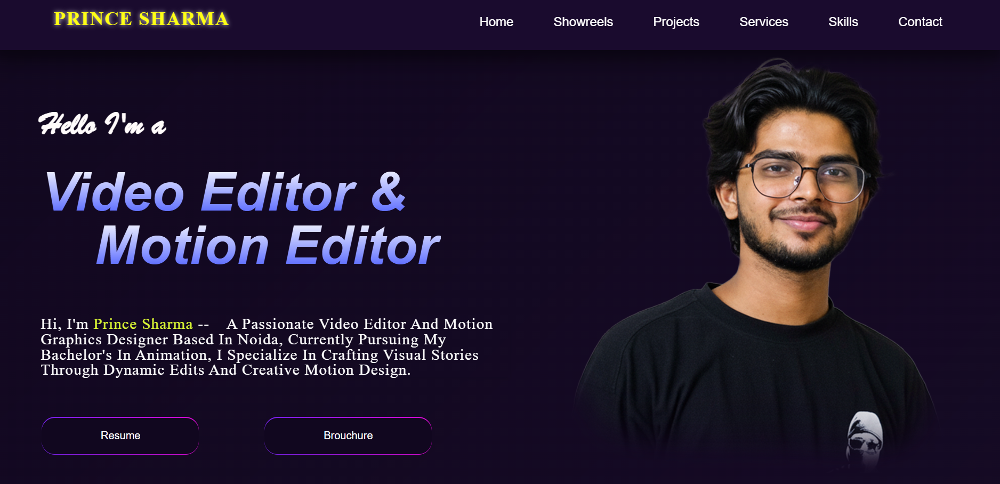
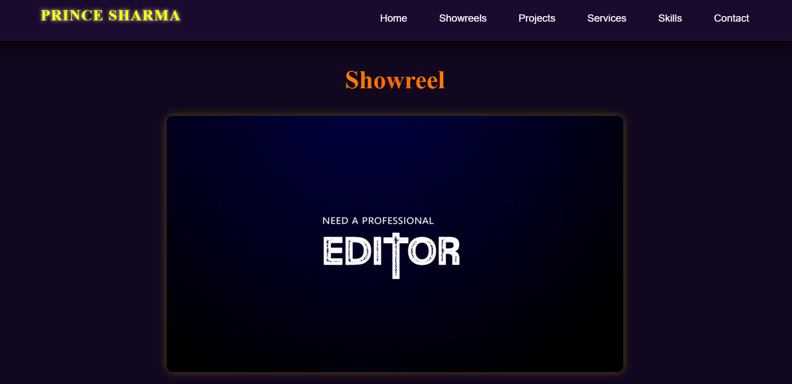
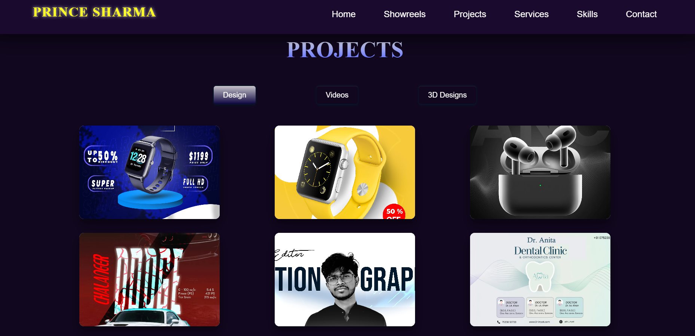
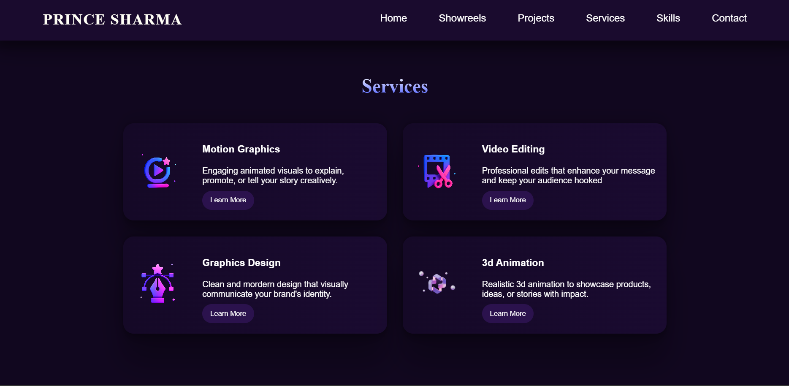
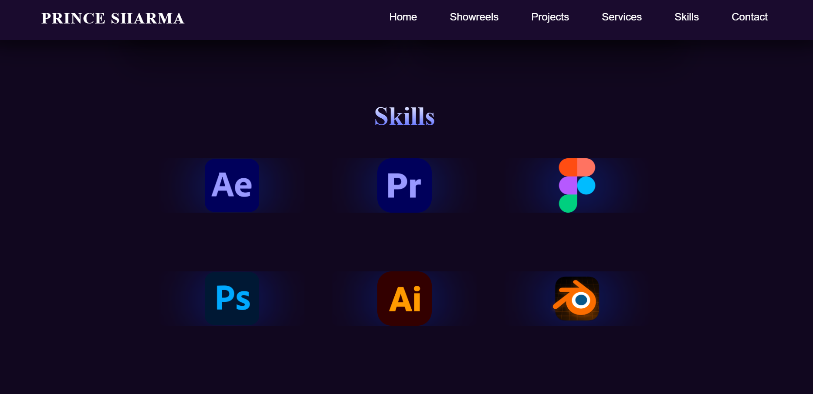
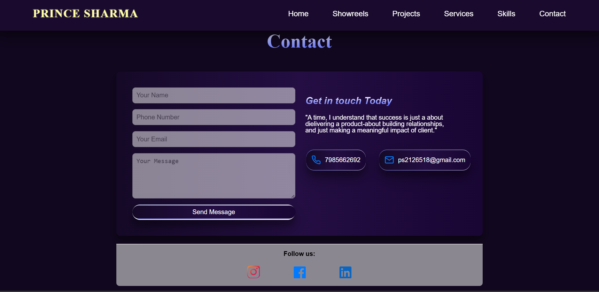

# Prince Video Editor — Web Video Editing Tool / Portfolio Project

Welcome to the **Prince Video Editor** web app / portfolio project!

This site showcases a web‑based video editing tool built using modern frontend technologies. It lets users perform video editing features (trim, cut, merge, effects, etc.) within the browser.  

🌐 **Live Site:** [https://prince-videoeditor.netlify.app/]

---

## 📌 About

**Prince Video Editor** is a frontend web application project focused on enabling in-browser video editing features. It’s built to demonstrate expertise in handling media, UI/UX for video tools, and responsive design.

---

## ✨ Features

- 🎞️ Upload / import video files (supported formats)  
- ✂️ Trim, cut, split video segments  
- 🔗 Merge multiple video clips  
- 🎨 Apply basic transitions, effects, overlays  
- 📂 Export or download edited video  
- 📱 Responsive and intuitive UI for desktop & mobile  
- 🧰 User-friendly controls & progress indicators  

---

## 🖼️ Screenshots

### 🏠 Homepage


### 🎬 Showreel


### 👨‍💻 Projects Section


### 🛠️ Services Section


### 📇 Skills Section


### 📬 Contact Section


---

## 🛠️ Technologies Used

- HTML5 
- CSS3 / Flexbox / Grid  
- JavaScript (ES6+)    
- Minified code via npm 
- Netlify (for deployment)  

---

## 📁 Folder Structure

```plaintext

├── assets
│── 3dvideos
│── assests
│── images
│── videos
├── index.html
├── media.min.css
├── README.md
├── script.min.js
└── style.min.css

Copyright (c) 2025 Raj Sharma

All rights reserved.

This portfolio website and all associated content (code, design, images, text) are protected by copyright law.

You MAY NOT:

- Copy, reproduce, distribute, or modify any part of this website without explicit written permission from Raj Sharma.
- Use this work for commercial purposes without authorization.
- Claim ownership or redistribute this content as your own.

You MAY:

- View and study the code and design for learning purposes only.
- Use the portfolio as inspiration with proper credit given.
- You can ask for the media files ( images,video,icons) used in it

For permissions, licensing, or collaborations, please contact:

Designer & Developer :

Name - Raj Sharma  
Email: hellojavos@gmail.com  
Website: https://prince-videoeditor.netlify.app/


